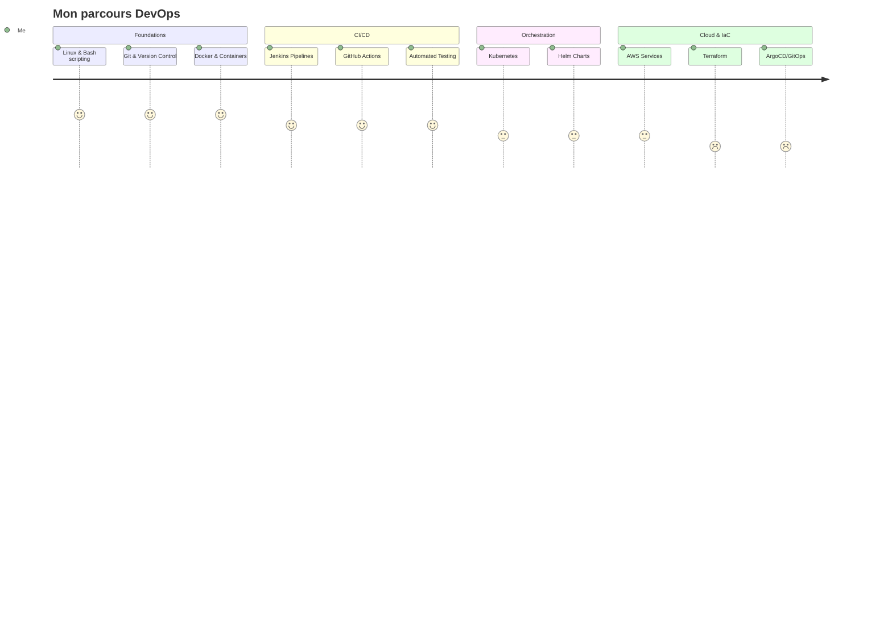

<div align="center">


<br/>

[](https://git.io/typing-svg)

<br/>

[](https://linkedin.com/in/manana-nyaary)
[](mailto:manananyaary@gmail.com)
[](https://wa.me/+261348658689)
[](https://github.com/NyAary29)

</div>

---

## 🧑‍💻 Who am I?

```yaml
name: Manana NyAary
location: Antananarivo, Madagascar 🇲🇬
role: Full-Stack Developer → DevOps Engineer (in transition)
company: ESN (Enterprise Software Company)

skills:
  backend:     [Node.js, Express, Python, REST APIs]
  frontend:    [React, Vue, Angular, TypeScript]
  devops:      [Docker, Kubernetes, Jenkins, CI/CD]
  cloud:       [AWS, Linux, Infrastructure automation]
  data_ai:     [ML, Deep Learning, PyTorch, TensorFlow]
  databases:   [PostgreSQL, MongoDB, MySQL]

currently_learning:
  - Kubernetes advanced orchestration
  - Terraform & Infrastructure as Code
  - GitOps & ArgoCD
  - Cloud certifications (AWS)

philosophy: "Ship fast. Break nothing. Automate everything."
```

---

## 🚀 DevOps Journey & Roadmap

<div align="center">



</div>

---

## 🛠️ Tech Stack

### ⚙️ DevOps & Cloud — Primary Focus

<div align="center">


</div>

### 💻 Full-Stack Development

<div align="center">


</div>

### 🗄️ Databases

<div align="center">


</div>

### 🤖 AI & Data Science

<div align="center">


</div>

---

## 📊 GitHub Activity

<div align="center">


</div>

<div align="center">


</div>

<div align="center">


</div>

---

## 🏆 Achievements

<div align="center">


</div>

---

## 💡 Pourquoi me recruter ?

<div align="center">

| 🔥 Atout | 💬 Ce que ça signifie pour vous |
|---|---|
| 🧠 Full-Stack + DevOps | Je comprends le code **et** l'infra — je déploie ce que je développe |
| 🎓 Formation IA/Big Data | Je lis, comprends et optimise des pipelines de données complexes |
| 🌍 ESN Experience | Habitué aux contextes multi-projets, délais serrés, clients exigeants |
| 🚀 Self-learner | Kubernetes, AWS, IaC — je monte en compétences sans attendre |
| 📍 Madagascar | Timezone +3, disponible, motivé, tarif compétitif |

</div>

---

## 🌐 Me contacter

<div align="center">

> 💼 Ouvert aux opportunités **DevOps / Cloud Engineer / SRE**  
> 📩 Réponse garantie sous 24h

[](mailto:manananyaary@gmail.com)
[](https://wa.me/+261348658689)

</div>

---

<div align="center">


</div>
